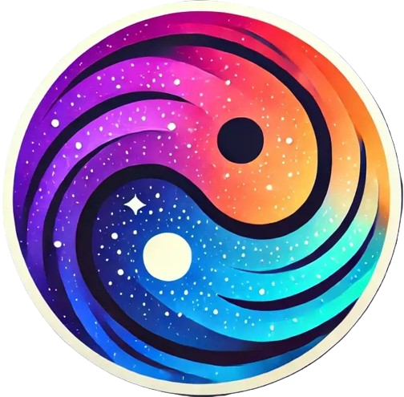
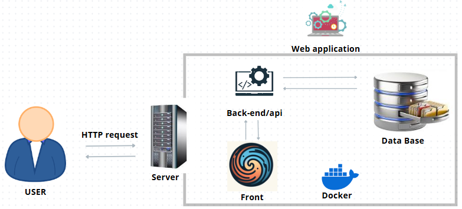
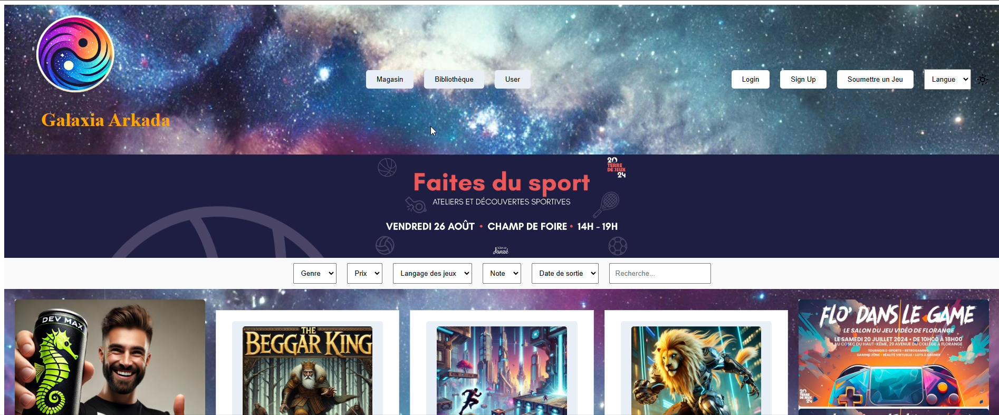

<p align="center">
  
</p>
<p align="center"><b>Galaxia_Arkada</b></p>

## Introduction

Galaxia Arkada is an online game hosting web application created by two students from Holberton School.
The platform is designed to feature a selection of small games, each developed by Holberton School students specializing in AR/VR.
The aim is to provide a fun, interactive environment where users can enjoy and explore innovative game designs.

## The Projet and The Context

Galaxia Arkada serves as a platform for showcasing the creativity and technical skills of Holberton School students.
Each game hosted on the platform highlights the cutting-edge work being done in the AR/VR specialization, providing a seamless integration of these technologies into an engaging user experience.

## The Team

Marc CORNABAS - Backend Developer
Role:Marc Cornabas is responsible for developing and maintaining the server-side logic of applications.
He manages databases, designs and implements APIs, and ensures efficient communication between the backend and frontend.
Additionally, Marc handles security, optimizes performance, and collaborates with frontend developers to deliver robust and scalable web applications

Antonin PAILLASSE - Frontend Developer
Role: Antonin is responsible for developing and maintaining the frontend of web applications.
He transforms design concepts into responsive, user-friendly interfaces using HTML, CSS, and JavaScript frameworks like React.js.
He collaborates with Marc CORNABAS back-end developers to ensure seamless integration, optimizes performance, and maintains high code quality.
His work directly impacts the user experience, ensuring the platform is both visually appealing and functionally robust.

## Blog posts

After the development phase, we each wrote a blog post to reflect on the Galaxia_Arkada.

- Antonin article : [Galaxia_Arkada](https://www.linkedin.com/pulse/galaxia-arkada-antonin-paillasse-yzr2c/?trackingId=S%2FZNGp4rT5CtDVyDBM5Ajw%3D%3D) -
  A deep dive into the frontend development of Galaxia Arkada.
- Marc article : [Galaxia_Arkada](https://www.linkedin.com/pulse/galaxia-arkada-marc-cornabas-kebee/?trackingId=kJLV6JI6TCm4e1BtTcSPxQ%3D%3D) - Insights into backend development and server-side logic.

# Architecture



## Run Galaxia_Arkada

```
npm run dev
```

## Tutorial

[Watch the Video on YouTube](https://youtu.be/nogf0xbyUx8)

## Known bugs

- **Problème** : Description du bug connu.
- **Impact** : Expliquez qui est affecté et comment.
- **Solution temporaire** : Si applicable, fournissez une solution ou une solution de contournement.

## Overview

**Galaxia Arkada** is an online gaming platform where users can create, share, and test their own video games. The platform is designed to allow game developers of all levels to collaborate and create immersive experiences in an online arcade environment.

### Project Goals:

- Allow users to create and upload Unity games directly to the platform.
- Provide an easy-to-use interface for testing games online.
- Offer a space to share and discover new games created by other users.

### Technologies Used:

- **Frontend**: React.js, Styled Components
- **Backend**: Node.js, Express
- **Database**: PostgreSQL
- **Game Platform**: Unity WebGL

### Target Audience:

Galaxia Arkada is intended for game developers, content creators, and gaming enthusiasts who want to share their creations and test games online.

### Key Features:

- Create and manage custom games.
- Upload and test Unity games online.
- Social interaction with other players and developers.
- Easy-to-use interface for managing games and user profiles.

### List of components

### 1. Frontend (React.js)

- **Description**: The frontend of the platform is built with React.js and Styled Components.
- **Responsibilities**: Handles the user interface, user interactions, and game rendering using Unity WebGL.
- **Technologies**: React.js, Styled Components, Axios, React Unity WebGL.

### 2. Backend (Node.js + Express)

- **Description**: The backend is built with Node.js and Express, responsible for handling API requests.
- **Responsibilities**: Manages user authentication, handles game uploads, and interacts with the database.
- **Technologies**: Node.js, Express, JWT (for authentication), Multer (for file uploads).

### 3. Database (PostgreSQL)

- **Description**: The database is used to store user data, game information, and metadata.
- **Responsibilities**: Stores and retrieves user profiles, game submissions, tags, and related data.
- **Technologies**: PostgreSQL, Sequelize ORM.

### 4. Game Engine (Unity WebGL)

- **Description**: The platform uses Unity WebGL to allow users to create and test games directly on the website.
- **Responsibilities**: Handles game rendering and user interaction within the Unity environment.
- **Technologies**: Unity, Unity WebGL.

### 5. Authentication Service

- **Description**: This component manages user login, registration, and session management.
- **Responsibilities**: Verifies user credentials, stores JWT tokens, and manages session persistence.
- **Technologies**: JWT, sessionStorage (for persistent login), bcrypt (for password hashing).

### 6. File Upload System (Multer + Unzipper)

- **Description**: Manages game file uploads, including validation and extraction.
- **Responsibilities**: Handles game file uploads, extracts Unity game assets, and ensures the integrity of files before they are added to the platform.
- **Technologies**: Multer, Unzipper, Node.js.

### Authentication

The **Galaxia Arkada** platform uses **JSON Web Tokens (JWT)** for user authentication. Here's how the authentication flow works:

### Authentication Flow:

1. **User Registration**: Users create an account by submitting their email, username, and password.
   - Endpoint: `POST /api/auth/register`
   - Upon successful registration, a JWT token is issued to the user.
2. **User Login**: Users log in with their credentials (email/username and password).
   - Endpoint: `POST /api/auth/login`
   - If credentials are valid, a JWT token is returned to the client.
3. **Token Storage**: The JWT token is stored in **sessionStorage** to maintain the user's session during navigation.
   - Tokens are valid for a set period (e.g., 1 hour) and can be refreshed if needed.
4. **Accessing Protected Routes**: For routes that require authentication, the JWT token is sent in the `Authorization` header.
   - Example header: `Authorization: Bearer <JWT_TOKEN>`

### Authentication Technologies:

- **JWT (JSON Web Token)**: Used for secure user authentication and session management.
- **bcrypt**: Used for hashing user passwords before storing them in the database.
- **sessionStorage**: Stores the JWT token on the client-side to persist the user's session.

### Endpoints:

- **Register**:
  - URL: `/api/auth/register`
  - Method: `POST`
  - Body: `{ email: <string>, username: <string>, password: <string> }`
  - Response: `{ token: <JWT_Token> }`
- **Login**:
  - URL: `/api/auth/login`
  - Method: `POST`
  - Body: `{ email: <string>, password: <string> }`
  - Response: `{ token: <JWT_Token> }`

### Security:

- **Password Hashing**: User passwords are hashed using **bcrypt** before being stored in the database.
- **Token Expiration**: JWT tokens are set to expire after a set period (e.g., 1 hour).
- **Token Refresh**: Optional refresh tokens can be implemented to extend user sessions.

### Session Management:

- After login, the JWT token is saved in **sessionStorage** and is sent with each subsequent request to protected routes.
- Tokens are automatically removed from **sessionStorage** on logout, effectively ending the user's session.

### Example of Protected Route Access:

To access a protected route (e.g., user profile), include the JWT token in the `Authorization` header

## Take a tour of the deployed version at Galaxia_Arkada

Experience **Galaxia Arkada** firsthand by visiting the live version of the platform! Here's a quick guide to help you explore the main features:

### 1. **Homepage**

- Upon visiting **Galaxia Arkada**, you'll be greeted with an interactive homepage showcasing the latest games and most popular titles.
- The homepage includes navigation links to register, log in, and explore games.
- You can view a selection of featured games and access game categories like **Action**, **Puzzle**, and **Adventure**.

### 2. **User Registration and Login**

- New users can easily sign up by entering their email, username, and password.
- Existing users can log in using their credentials, or via a third-party authentication service (if available).
- After logging in, users can access their profile and game dashboard.

### 3. **Create and Upload Games**

- Logged-in users can create and upload their own Unity games directly to the platform.
- Simply navigate to the **Upload Game** section, where you can upload your game files and add metadata (e.g., description, tags, category).

### 4. **Play and Test Games**

- Browse and play games uploaded by other users in a seamless Unity WebGL interface.
- Test your own games directly in the browser and experience the full functionality of each game.
- Games can be rated, commented on, and shared with friends.

### 5. **User Profiles**

- Users have customizable profiles that display their uploaded games, achievements, and community interactions.
- You can follow other users, interact with them in the community, and share your game creations.

### 6. **Social Features**

- Engage with the community by rating and commenting on games.
- Discover games created by others and participate in discussions or challenges.

### 7. **Explore More**

- Explore other features, like game categories, leaderboards, or specific user-created game events.
- The platform offers a rich experience for developers and gamers alike.

**Check out the live version of Galaxia Arkada**:  
[Watch the Video on YouTube](https://youtu.be/nogf0xbyUx8)

### Screenshot Preview:

Here's a quick preview of what you'll see when you log in to the platform:



Feel free to take a tour and start creating, testing, and sharing games with the world!

# Acknowledgments

I would like to express my heartfelt thanks to the following:

### My Team:

- **Antonin** - Frontend Developer, for creating the user interface and experience, and for managing the frontend architecture.
- **Marc** - Backend Developer, for his hard work on the server-side logic and database management.

### Libraries and Tools:

- **React.js**: For providing a powerful framework to build the frontend of the platform.
- **Node.js** and **Express**: For building the robust backend API and handling server-side logic.
- **Unity WebGL**: For enabling seamless game development and in-browser gameplay.
- **PostgreSQL**: For powering the database that stores user data and game information.
- **Multer** and **Unzipper**: For handling file uploads and extracting Unity game assets efficiently.
- **JWT (JSON Web Token)**: For securing authentication and managing user sessions.
- **Styled Components**: For styling the React components with a modern approach.

### External Resources:

- **React Docs**: [https://reactjs.org/docs](https://reactjs.org/docs) - For in-depth guidance on React.
- **Node.js Docs**: [https://nodejs.org/en/docs](https://nodejs.org/en/docs) - For understanding how to build server-side applications.
- **Unity Documentation**: [https://docs.unity.com](https://docs.unity.com) - For learning Unity WebGL deployment and game optimization.
- **Stack Overflow Community**: For providing support and solutions to challenging problems during development.

### Special Thanks:

- My family and friends for their continuous support and encouragement throughout the development process.
- The **Duck23** community for their feedback and ideas that helped shape the direction of the platform.

# License

This project is licensed under the MIT License - see the LICENSE file for details.
